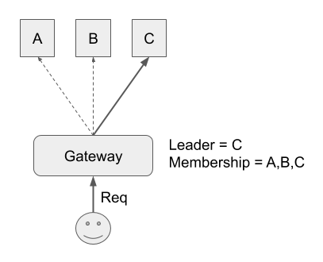

# Gateway

In Raft, client request is sent to the leader and processed by the leader. So how did the client know who is the leader?

In Raft dissertation, some algorithm are described. One of which is sending back knowing leader as a hint when client sent the request to some non-leader. Forwarding the request to leader is also explained.

But how do you access the follower? More precisely, how do you know at least one node in the current membership?

lol's `Gateway` tracks the current membership by polling the membership so client can grab at least one node in the cluster. After giving some valid members to the `Gateway` manually, `Gateway` automatically tracks the cluster until it is destructed.

