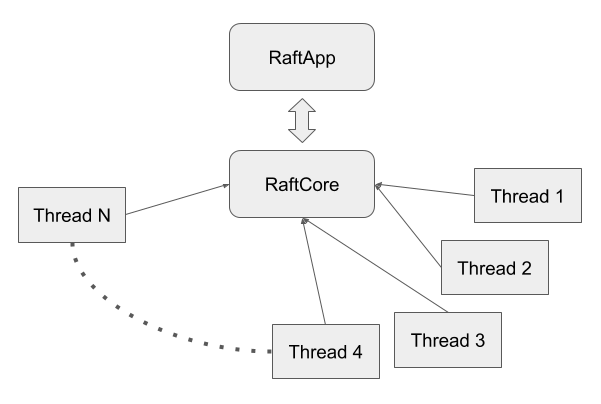

# Overview of the architecture

This chapter describes the overview of the architecture.

`RaftCore` is the heart of the Raft system. It includes internal states and functions that typically happens side effects.

Around the `RaftCore`, there are many companion threads that loops and calls functions to `RaftCore` when some conditions are met. Some threads don't simply loop but wait for some conditions to immediately wake up when it is met. It may be a bit surprise that even gRPC server is a thread that interacts with the `RaftCore`. How much threads are there? As of 0.4, there are more than 10 threads around the core. This architecure is much like operating system that daemon threads are orbiting around the kernel.

The last element of the system is `RaftApp`. 
As its name suggests, it is a user application runs on the `RaftCore`. The responsibility of the `RaftApp` is said to be only two things:

1. Apply the messages to the state machine
2. Make a new snapshot

Combining these three things together, you can build your own Raft process that interacts with other Raft processes to form a Raft cluster of your own.

If you are ready to implement your own `RaftApp`, API doc and the KVS implementation under kvs/ would help.