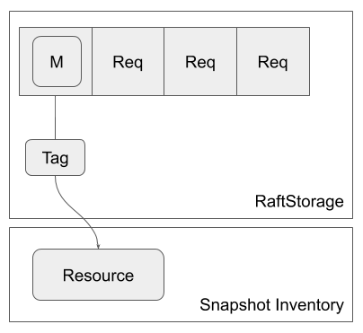

# How snapshots are managed

In the previous section, you have learned that the snapshot is placed in somewhere outside the log entry and copy to other nodes in streaming.

The snapshot entity that is made from the stream and sent in stream is called *snapshot resource*.

lol does't care what it actually is and where it is actually placed but let's call it *snapshot inventory*.

Another player is called *snapshot tag*.
Snapshot tag is like metadata that identifies a snapshot resource.

In `RaftApp`'s `apply_message`, you can return a new snapshot tag from the function after creating the corresponding snapshot resource and saving it.

The snapshot tag is then saved in `RaftStorage` so it can be used later and its snapshot resource can be purged when it is older than the latest snapshot.

For example, snapshot tag can be a file path when snapshot resource is a file and snapshot tag can be a object key when the snapshot resource is placed in Amazon S3.